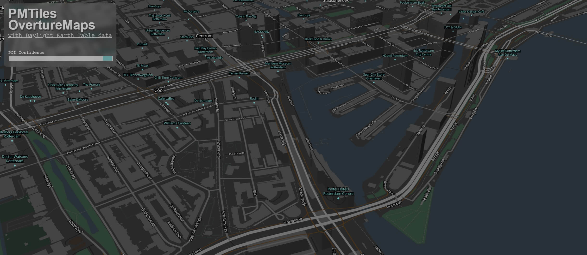

# overture-maps

Playing around with data from OvertureMaps.

-   Download OvertureMaps and Daylight data
-   Extract data from OvertureMaps and Daylight for a country and convert to geoparquet
-   Create PMTiles from extracted data
-   Notebook with some queries and a map to display some data

Demo viewer for generated PMTiles: [https://tebben.github.io/overture-maps/](https://tebben.github.io/overture-maps/)



## Download overture-maps data

For the notebook and scripts to create extracts, geoparquet and PMTiles we need all the data locally. Run `scripts/download_overture_data.sh` to download all overture parquet files from AWS without needing to login. This will take some time to run since this is around 200GB. This script will install AWS cli if not found on the system.

```sh
./scripts/download_overture_data.sh
```

## Playing around with the overture data in a notebook

Notebook to have a closer look at the data and see if we can show something on a map.

### Install miniconda

Install miniconda if not installed yet.

```sh
./scripts/install_miniconda.sh
```

### Create environment

Create a conda environment and install some dependencies.

```sh
conda create -n overture python=3.10
conda activate overture
conda install pip
pip install -r requirements.txt
```

### Open notebook

Open ./notebooks/hello_overture.ipynb and select kernel overture from our conda environment.

## Extract data, convert to geoparquet and create PMTiles

Make sure DuckDB, gpq, tippecanoe and pmtiles are installed

```sh
sudo ./scripts/install_duckdb.sh
sudo ./scripts/install_gpq.sh
sudo ./scripts/install_pmtiles.sh
sudo ./scripts/install_tippecanoe.sh
```

### Create bounds

In our test we don't want to do the whole world so we create some bounds, in this case country bounds of The Netherlands, supply the country code to the script. In the next example we create bounds for The Netherlands.

```sh
./scripts/create_country_bounds.sh NL
```

### Extract data and convert to geoparquet

The following script will create geoparquet files for all overture-maps themes with only data inside our given bounds, for pmtiles we don't need geoparquet but it's nice to have anyways. This can take some time, no fancy things are done such as spatial partitioning/indexing.

```sh
./scripts/convert/overture/to_geoparquet.sh
```

### Create GeoJSON

For the PMTiles creation we need GeoJSON files, the script `parquet_to_geojson.sh` creates geojson files for each theme from our geoparquet files which than can feeded into tippecanoe. Not every field is added to the GeoJSON feature properties at the moment.

```sh
./scripts/convert/overture/parquet_to_geojson.sh
```

### Create PMTiles

When we have the GeoJSON files we can create our PMTiles using tippecanoe and pmtiles.

```sh
./scripts/convert/overture/geojson_to_pmtiles.sh
```

This will create mbtiles for each theme, merge them and convert to PMTiles. Directly creating pmtiles with tippecanoe resulted in a PMTiles V2 file which could not be converted to v3, therefore mbtiles are created and later converted into PMTiles using `pmtiles convert`

### Run viewer to view PMTiles

In the folder `viewer` a maplibre-gl viewer can be found which loads the PMTiles file locally.

```sh
cd viewer
npm install
npm run dev
```
